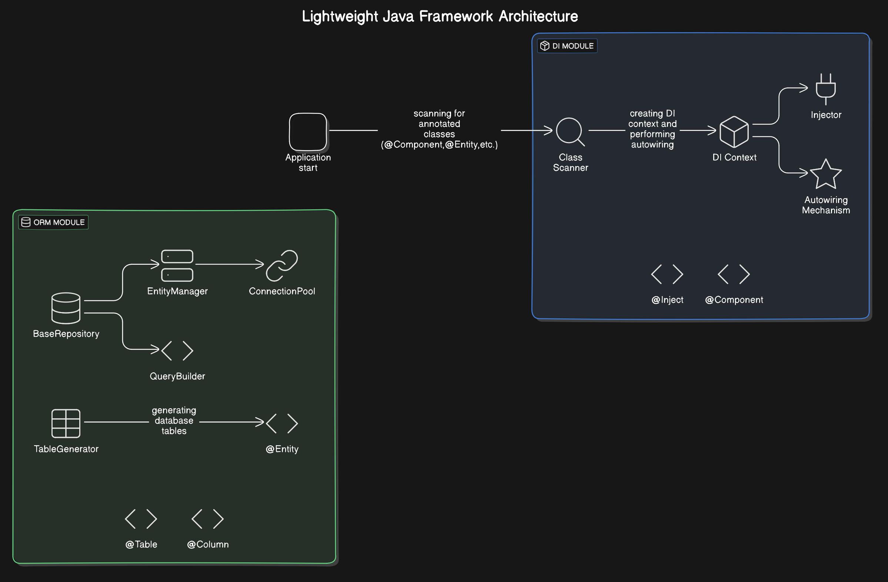

# Codex DI Framework

A lightweight Dependency Injection and ORM framework for Java applications.

## Installation

1. Clone the repository:
   ```
   git clone git@github.com:AymaneTech/Codex-DI-framework.git
   ```

2. Navigate to the project directory:
   ```
   cd Codex-DI-framework
   ```

3. Install the framework to your local Maven repository:
   ```
   mvn clean install
   ```

4. Add the following dependency to your project's pom.xml:
   ```xml
   <dependency>
       <groupId>ma.codex</groupId>
       <artifactId>codex-DI-framework</artifactId>
       <version>1.0-SNAPSHOT</version>
   </dependency>
   ```

## Usage

### Main Application

Create a main class and use the `Kernel.run()` method to start your application:

```java
import ma.codex.framework.Kernel;

public class Application {
   public static void main(String[] args) throws SQLException {
      Kernel.run(Application.class);
   }
}
```

### Dependency Injection

Use annotations to define and inject dependencies:

```java
import ma.codex.framework.iocContainer.annotations.Autowired;
import ma.codex.framework.iocContainer.annotations.Component;
import ma.codex.framework.iocContainer.annotations.Qualified;

@Component
public class Client {
   private Service service;

   @Autowired
   public Client(@Qualified(ServiceImpl.class) Service service) {
      this.service = service;
   }
}

@Component
public class ServiceImpl implements Service {
   // Implementation
}

public interface Service {
   // Service interface
}
```

### Entity Creation

Define entities using annotations:

```java
import ma.codex.framework.Persistence.Annotations.*;
import ma.codex.framework.Persistence.Annotations.Relations.*;
import ma.codex.framework.Persistence.Enums.CascadeType;

@Entity(name = "products")
public class Product {
   @ID
   @Column(name = "id")
   private Long id;

   @Column(name = "name", size = 40)
   private String name;

   @Column(name = "description", type = "text")
   private String description;

   @ManyToOne(mappedBy = "categories")
   @Definition(tableName = "products", columnName = "category_id",
           referencedTable = "categories", referencedColumn = "id",
           cascade = CascadeType.ALL)
   @Column(name = "category_id")
   private Long categoryId;

   @ManyToMany
   private List<Cart> carts;
}

@Entity(name = "categories")
public class Category {
   @ID
   private Long id;

   @Column(name = "name", size = 40)
   private String name;

   @Column(name = "description", type = "text")
   private String description;

   @OneToMany(mappedBy = "products")
   private List<Product> products;
}
```

## Features

- Dependency Injection with `@Autowired`, `@Component`, and `@Qualified` annotations
- ORM capabilities with `@Entity`, `@Column`, `@ID`, and relationship annotations
- Automatic schema generation based on entity definitions

## Contributing
- Fork the repository and create a new branch
- Write clear and concise commit messages
- Ensure all tests pass before submitting a pull request
- Follow the project's coding standards and guidelines

# Project acrchitecture

# ecomove-transport-reservation-system
